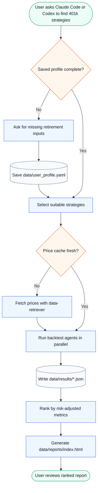
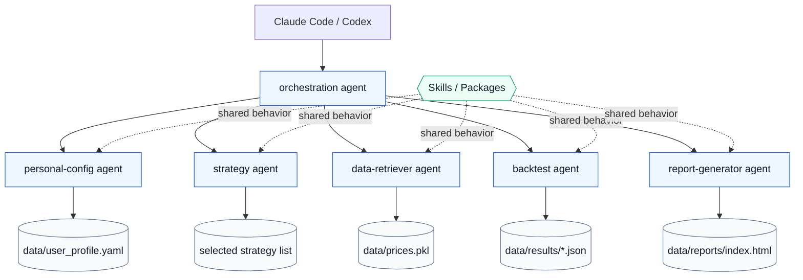

# IRA Strategies

Agent-first 401k strategy optimization for self-directed retirement accounts.

This project is designed to be run through Claude Code or Codex, not as a
monolithic application. Each agent is a deployable unit with its own prompt,
script, dependencies, and implementation details. Agents communicate through
explicit artifacts under `data/`.

## Operating Model

In Claude Code:

```text
/find-best
```

Or ask:

```text
Build 401k strategies for my profile.
```

In Codex, address the orchestration agent:

```text
Have orchestration build 401k strategies for a 40-year-old with moderate risk.
```

CLI fallback:

```bash
python agents/orchestration/orchestrate.py run
```

The workflow writes:

- `data/user_profile.yaml` - retirement profile
- `data/prices.pkl` - yfinance cache
- `data/results/*.json` - one result per completed backtest
- `data/reports/index.html` - generated final report

## User Workflow



## Architecture

The architecture is intentionally agent-first.

- **Agents are microservices.** Each agent owns its runtime, prompt, command-line
  entry point, dependencies, and local implementation.
- **Skills are packages.** Shared behavior should be promoted into a skill or
  versioned dependency and consumed explicitly by the agents that need it.
- **Artifacts are the API.** Agents coordinate through CLI args, stdout/stderr,
  and files in `data/`.



## Design Principles

1. **Agent autonomy over shared-library convenience.**
   Agents must be independently runnable and testable. They do not import code
   from repository-root modules or sibling agents.

2. **Explicit contracts over hidden coupling.**
   Cross-agent contracts are files, CLI arguments, stdout/stderr, and documented
   schemas. There is no implicit in-process API between agents.

3. **Local ownership over clever abstraction.**
   An agent may duplicate small amounts of code if that keeps ownership clear.
   Shared abstractions are introduced only when the behavior is stable enough to
   become a skill/package.

4. **Generated outputs are disposable.**
   `data/reports/index.html`, `data/prices.pkl`, and `data/results/*.json` are
   workflow artifacts. Do not hand-edit generated output.

5. **No personal data in source.**
   User-specific retirement details live in gitignored `data/user_profile.yaml`.
   Source files must remain safe for a public repository.

6. **No look-ahead bias.**
   Backtest strategies only use price data available at the `as_of` date.

## Trade-Offs

| Decision | Benefit | Cost |
|---|---|---|
| Self-contained agents | Agents are deployable, replaceable, and easier to reason about in isolation | Some code and constants are duplicated |
| File-based coordination | Simple, observable, tool-friendly contracts | Requires schema discipline and cleanup of stale artifacts |
| Skills/packages for sharing | Reuse is explicit and versionable | More overhead than importing a local file |
| Parallel backtest fan-out | Faster strategy evaluation | Requires deterministic result files and robust partial-failure handling |
| Generated static report | Easy GitHub Pages deployment and review | Report must be regenerated after result changes |
| Zero transaction costs | Correct default for tax-advantaged accounts with free ETF trading | Not suitable for taxable brokerage or high-friction assets without extension |

## Agent Responsibilities

| Agent | Responsibility | Primary Artifacts |
|---|---|---|
| `orchestration` | Coordinates the end-to-end workflow | workflow stdout, `data/reports/index.html` |
| `personal-config` | Reads, validates, and updates retirement profile | `data/user_profile.yaml` |
| `strategy` | Filters strategy candidates by profile constraints | selected strategy list |
| `data-retriever` | Checks and refreshes yfinance cache | `data/prices.pkl` |
| `backtest` | Runs one strategy by index | `data/results/{hash}.json` |
| `report-generator` | Builds ranked HTML report from result JSON | `data/reports/index.html` |

## Cross-Agent Contracts

The only supported cross-agent interfaces are:

- CLI arguments
- process exit codes
- stdout/stderr
- `data/user_profile.yaml`
- `data/prices.pkl`
- `data/results/*.json`
- `data/reports/index.html`

Do not add imports across agent directories. Do not recreate a root application
layer for shared code. If multiple agents need the same implementation, extract it
into a skill/package and declare that dependency explicitly.

## Extension Points

Add a new strategy:

1. Add metadata to `agents/strategy/strategy_catalog.py`.
2. Add executable logic to `agents/backtest/backtest_core.py`.
3. Keep catalog indexes synchronized with `build_strategies()`.
4. Validate with:

```bash
python agents/strategy/select_strategies.py list --json
python agents/backtest/run_backtest.py --index N --total 1 --json
```

Add a new asset:

1. Add the ticker to the local asset lists in:
   - `agents/backtest/backtest_core.py`
   - `agents/strategy/strategy_catalog.py`
   - `agents/data-retriever/fetch_data.py`
2. Refresh the cache:

```bash
python agents/data-retriever/fetch_data.py refresh
```

Add shared behavior:

1. Promote it into a skill/package.
2. Version it.
3. Add it to each consuming agent's dependency manifest.
4. Keep each agent runnable without importing sibling directories.

## Validation

Fast checks:

```bash
python agents/strategy/select_strategies.py filter --profile data/user_profile.yaml
python agents/data-retriever/fetch_data.py check
python agents/backtest/run_backtest.py --index 5 --total 1 --json
node agents/report-generator/generate_report.js --results-dir data/results --total 1
python agents/orchestration/orchestrate.py run --dry-run
```

Full workflow:

```bash
python agents/orchestration/orchestrate.py run
```

## Operational Notes

- Most of `data/` is gitignored because it can contain user-specific or large
  cache artifacts. `data/reports/` is intentionally tracked for GitHub Pages.
- `data/reports/index.html` is generated locally by the agent workflow and
  committed for GitHub Pages publishing.
- CI does not run backtests. It publishes the committed report to GitHub Pages.
- Network access is required when refreshing yfinance data.
- A complete workflow can still produce partial results if some strategy workers
  fail; the report should reflect completed result JSON files.

## Disclaimer

Backtests are hypothetical and based on historical data. Past performance does not
guarantee future results. This is an educational research tool, not financial advice.
