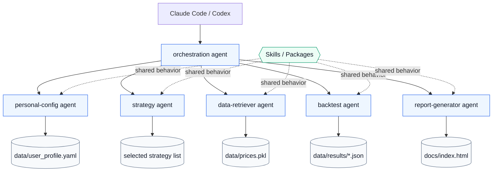

# IRA Strategies

Agent-driven 401k strategy optimization for self-directed retirement accounts.

This repo is intended to be run through Claude Code or Codex. Each agent is
self-contained: it owns the code it executes and communicates through `data/`
artifacts instead of importing shared repo modules.

## Run

In Claude Code:

```text
/find-best
```

Or ask:

```text
Build 401k strategies for my profile.
```

In Codex, address the orchestration agent:

```text
Have orchestration build 401k strategies for a 40-year-old with moderate risk.
```

CLI fallback:

```bash
python agents/orchestration/orchestrate.py run
```

The workflow writes:

- `data/user_profile.yaml` - retirement profile
- `data/prices.pkl` - yfinance cache
- `data/results/*.json` - one result per completed backtest
- `docs/index.html` - generated report

## Architecture

This project uses an agent-first architecture.

Agents are the microservices. Each agent owns its runtime, prompt, script,
dependencies, and local implementation details. An agent should be independently
runnable and replaceable.

Skills are the packages. When behavior needs to be reused across agents, package it
as a skill or versioned dependency and declare it in the agents that consume it.
Do not share behavior by importing files across agent directories or from the repo
root.



The only cross-agent contract is explicit data:

- CLI arguments
- process stdout/stderr
- files under `data/`
- generated report output under `docs/`

## Agents

| Agent | Role |
|---|---|
| `orchestration` | Coordinates the full workflow |
| `personal-config` | Reads/writes `data/user_profile.yaml` |
| `strategy` | Selects strategy candidates from its local catalog |
| `data-retriever` | Ensures yfinance price cache is available |
| `backtest` | Runs one strategy using its local backtesting core |
| `report-generator` | Builds `docs/index.html` from result JSON |

## Self-Containment Rule

Agents must not import implementation modules from the repo root or from sibling
agents. If logic must be shared, promote it into a skill/package and consume that
package from each agent. Duplicating code inside an agent is acceptable when it
preserves independent execution.

## Validation

```bash
python agents/strategy/select_strategies.py filter --profile data/user_profile.yaml
python agents/data-retriever/fetch_data.py check
python agents/backtest/run_backtest.py --index 5 --total 1 --json
node agents/report-generator/generate_report.js --results-dir data/results --total 1
python agents/orchestration/orchestrate.py run --dry-run
python agents/orchestration/orchestrate.py run
```

## Disclaimer

Backtests are hypothetical and based on historical data. Past performance does not
guarantee future results. This is an educational research tool, not financial advice.
