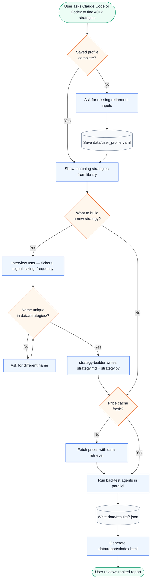
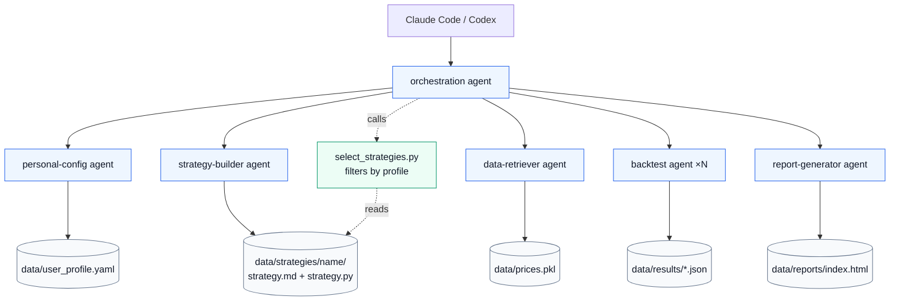

# IRA Strategies

Agent-first 401k strategy optimization for self-directed retirement accounts.

Designed to run through Claude Code or Codex. Each agent is a deployable unit with its own prompt, script, and dependencies. Agents communicate through explicit artifacts under `data/`.

## How to run

**Claude Code**
```text
/find-best
```
or just ask:
```text
Find the best strategies for my 401k.
```

**Codex** — address the orchestration agent directly:
```text
Have orchestration find the best 401k strategies for a 40-year-old with moderate risk.
```

**CLI fallback** (non-interactive, skips the "build new strategy?" step):
```bash
python agents/orchestration/orchestrate.py run
```

The workflow writes:

- `data/user_profile.yaml` — retirement profile
- `data/prices.pkl` — yfinance price cache
- `data/strategies/<name>/strategy.{md,py}` — strategy specs and implementations
- `data/results/*.json` — one result per completed backtest
- `data/reports/index.html` — final ranked report

---

## User Workflow



---

## Architecture



---

## Agent Responsibilities

| Agent | Type | Role |
|---|---|---|
| `orchestration` | AI subagent | Full interactive workflow: profile → show strategies → optional build → backtests → report |
| `personal-config` | AI subagent | Reads and writes `data/user_profile.yaml` |
| `strategy-builder` | AI subagent | Interviews user, generates `data/strategies/<name>/strategy.{md,py}`, validates |
| `data-retriever` | AI subagent | Checks and refreshes the yfinance price cache |
| `backtest` | AI subagent | Runs one strategy by index, saves result JSON |
| `report-generator` | Script | Builds ranked HTML report from result JSON files |
| `select_strategies.py` | Script | Filters strategy library by user profile constraints |

---

## Strategy Library

All strategies — both built-in and user-generated — live under `data/strategies/`. Each strategy is a folder containing two files:

```
data/strategies/
  16-adaptive-aa-top3/
    strategy.md     ← human-readable spec
    strategy.py     ← implementation (auto-discovered by the backtest runner)
  my-custom-strategy/
    strategy.md
    strategy.py
```

Built-in strategies are numbered (`01-` … `18-`) so they sort first. User-generated strategies have no prefix.

Each `strategy.py` exports:
- `METADATA` — plain dict with `name`, `label`, `rebalance_rule`, `suitable_for`
- `STRATEGY_CLASS` — callable `(tickers) → Strategy`
- `RULE` — a `RebalanceRule` instance from `RULES`

The runner injects `Strategy`, `RULES`, `pd`, `np` into every file's namespace, so **strategy files need no import statements**.

---

## Design Principles

1. **Agent autonomy over shared-library convenience.**
   Agents must be independently runnable and testable. They do not import code from repository-root modules or sibling agents.

2. **Explicit contracts over hidden coupling.**
   Cross-agent contracts are files, CLI arguments, and stdout/stderr. No implicit in-process API between agents.

3. **Local ownership over clever abstraction.**
   An agent may duplicate small amounts of code to keep ownership clear. Shared abstractions are introduced only when stable enough to become a versioned dependency.

4. **Generated outputs are disposable.**
   `data/reports/index.html`, `data/prices.pkl`, and `data/results/*.json` are workflow artifacts. Do not hand-edit them.

5. **No personal data in source.**
   User-specific details live in gitignored `data/user_profile.yaml`. Source files are safe for a public repository.

6. **No look-ahead bias.**
   Strategy implementations only use price data available at the `as_of` date.

---

## Adding a new strategy

Use `/build-strategy` in Claude Code, or ask the orchestration agent:

> "I want to test a strategy where I only hold QQQ but buy back in daily over the month."

The orchestration agent will interview you, check the name is unique in `data/strategies/`, and invoke the `strategy-builder` to generate the files. The new strategy is immediately available for backtesting.

To add one manually:
1. Create `data/strategies/<your-name>/strategy.md` — spec document
2. Create `data/strategies/<your-name>/strategy.py` — implementation following the standard format
3. Validate:
```bash
python agents/strategy/select_strategies.py list --json
python agents/backtest/run_backtest.py --index N --total 1 --json
```

## Adding a new asset

Add the ticker to all three asset lists:
```bash
# agents/backtest/backtest_core.py  → ASSETS list
# agents/strategy/strategy_catalog.py  → TICKERS list
# agents/data-retriever/fetch_data.py  → TICKERS list
```
Then refresh the cache:
```bash
python agents/data-retriever/fetch_data.py refresh
```

---

## Validation

```bash
python agents/strategy/select_strategies.py filter --profile data/user_profile.yaml
python agents/data-retriever/fetch_data.py check
python agents/backtest/run_backtest.py --index 5 --total 1 --json
node agents/report-generator/generate_report.js --results-dir data/results --total 1
python agents/orchestration/orchestrate.py run --dry-run
```

Full workflow:
```bash
python agents/orchestration/orchestrate.py run
```

---

## Operational Notes

- Most of `data/` is gitignored except `data/reports/` (tracked for GitHub Pages) and `data/strategies/` (tracked as source of truth for the strategy library).
- CI publishes the committed report to GitHub Pages — it does not run backtests.
- Network access is required when refreshing yfinance data.
- A workflow can produce partial results if some backtest workers fail; the report reflects whatever completed.

---

## Disclaimer

Backtests are hypothetical and based on historical data. Past performance does not guarantee future results. This is an educational research tool, not financial advice.
